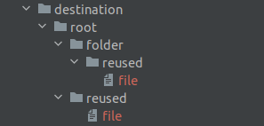
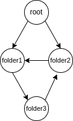

# Test task for JetBrains internship

## Some words about task implementation:

1. While executing the program there can be thrown exceptions in case of problems with creating entries.
I implemented my own type of exception: `FSException`

2. I change a little bit signature of the method `create`:

    ```fun create(entryToCreate: FSEntry, destination: String, rewriteExisting: Boolean = false)```

    The purpose of the `rewriteExisting` parameter is to indicate what logic the code will follow if the user wants 
to create an existing file or directory:

    Values and meanings: 

* `false` (default value) - in this case when user is trying to create an existing file or directory an `FSException` will be thrown.
* `true` - in this case for file previous content will be rewritten to the new one, for directory new files and folders
will be added in it, old content will stay untouched.

3. To run tests please use:  `./gradlew test`

## Loops in structure and reusing FSiles and FSolders:

Before starting to create a user-defined file structure, a check is made for loops that may cause infinite creation. 
If such a loop is present, a corresponding exception will be thrown.

Since there is no connection between FSFile and FSFolder objects and physically created files and folders, 
this implementation allows to reuse FSFiles and FSFolders.
In physical terms, this would mean creating files or folders with the same name and content, but in different locations.

## Examples of correct and incorrect structures with reused FSFiles and FSFolders:

1. Correct FSFile reusing:

```kotlin
val file = FSFile("file", "File content")
val folder = FSFolder("folder", listOf(file))
val rootFolder = FSFolder("root", listOf(file, folder))
FSCreator.create(rootFolder, destination)
```

Resulting structure:


2. Correct FSFolder reusing:

```kotlin
val file = FSFile("file", "File content")
val reusedFolder = FSFolder("reused", listOf(file))
val folder = FSFolder("folder", listOf(reusedFolder))
val rootFolder = FSFolder("root", listOf(reusedFolder, folder))
FSCreator.create(rootFolder, destination)
```

Resulting structure:



3. Incorrect FSFolder reusing:

```kotlin
val content1 = mutableListOf<FSEntry>()
val folder1 = FSFolder("folder1", content1)
val content2 = mutableListOf<FSEntry>()
val folder2 = FSFolder("folder2", content2)
val content3 = mutableListOf<FSEntry>()
val folder3 = FSFolder("folder3", content3)
val rootFolder = FSFolder("root", listOf(folder1, folder2))
content1.add(folder3)
content2.add(folder1)
content3.add(folder2)
FSCreator.create(rootFolder, destination)
```

As a result it will cause `FSException: File structure contains a loop`, because the defined structure looks like 
this and contains a loop:

